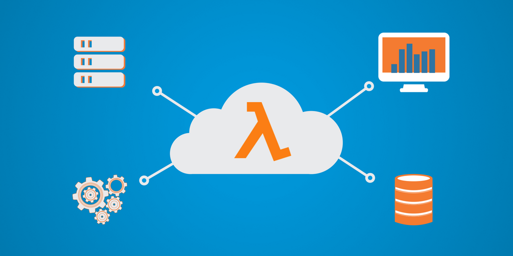

<h1 align="center">AWS Lambda & Serverless Architecture</h1>

    

    
    
    

---

# 💻 About the project

- AWS Lambda is a serverless, event-driven compute service that lets you run code for virtually any type of application or backend service without provisioning or managing servers. You can trigger Lambda from over 200 AWS services and software as a service (SaaS) applications, and only pay for what you use.

---

## ⚙️ Activities

- [ ] Build Serverless Workflows
- [ ] Process Streaming Data
- [ ] Setup Serverless Authentication and Authorization
- [ ] Build Serverless APIs
- [ ] Build Serverless Web App
- [ ] Build Android and iOS Mobile Apps
- [ ] Create an Alexa skill
- [ ] Make an IoT app

## 🛠 Tecnologies

The following tools were used in building the project:

- **[Node](https://nodejs.org/en/download/)**
- **[JavaScript ES6](https://www.javascript.com/)**

**Utilities**

- IDE: **[Visual Studio Code](https://code.visualstudio.com/download)**
---

## 🦸 Author

<a href="#">
 
 

Made by Douglas Souza 👋🏽 Get in touch!

---
## README versions

[English 🇺🇸](./README.md)